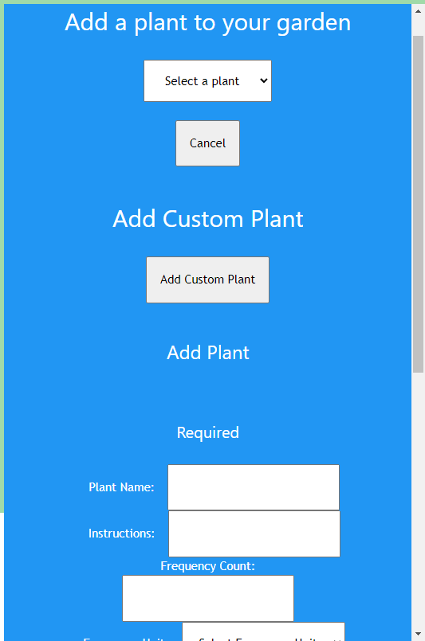
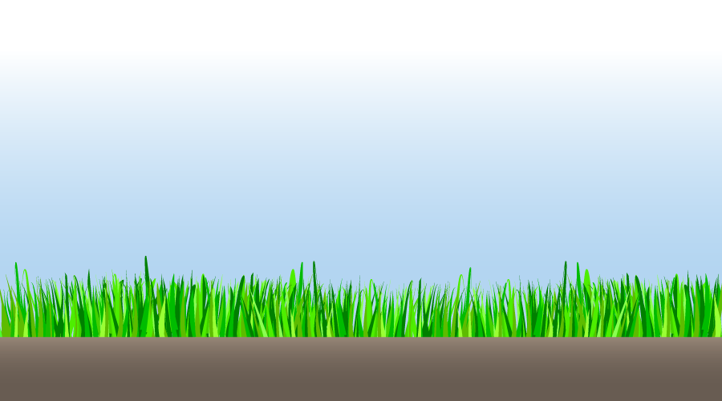
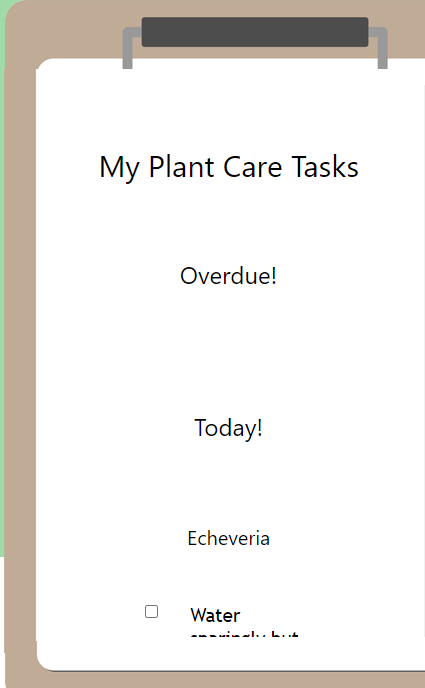
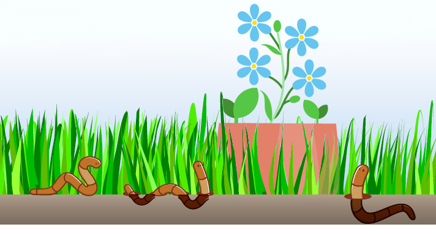

# Forget Me Not Plant Planner

## Table of Contents

* [Description](#description)
* [Live-URL](#live-url)
* [Screenshots](#screenshots)
* [Technologies-Used](#technologies-used)
* [Installation](#installation)
* [Credits](#credits)
* [Features](#features)
* [Usage-Information](#usage-information)
* [Suggested-Future-Development](#suggested-future-development)
* [Contribution-Guidelines](#contribution-guidelines)
* [Test-Instructions](#test-instructions)
* [License](#license)
* [Questions](#questions)

## Description
* If you’re one of those people who has trouble keeping plants alive, the problem is probably not your thumb… it’s knowing what your plant needs, when it needs it, and how to do it.
* Often we forget to water our plants because we get busy with other things, or aren’t sure how often they actually need to be watered. Forget-Me-Not Plant Planner offers a centralized place to track your plant care tasks and refer to what your plants need and when.
* As an aspiring gardener, I want to make sure my plants get the best care by creating a schedule of when they are due for watering.
* I want a tool where I can see an overview of all my plants and their likely condition, view care-related details, and, most importantly, see what I need to do when.
* I primarily want to track watering schedules but eventually I would like to add dates for planting, fertilizing, pruning etc.

## Live-URL

[Link to live URL]()

## Screenshotsg

## Technologies-Used

This application was created using the MERN stack along with:

* Bcrypt
* JSON Web Tokens
* Apollo GraphQL
* GraphQL
* Mongoose
* NodeMon
* React-Bootstrap
* Full Calander
* ESLint
* W3.css

## Installation

## Credits

Our team of contributors:

* Heidi Carrier
* Nathaniel Davis
* Matheus Almeida
* Thomas Neylon

## Features

## Usage-Information

## Suggested-Future-Development

* Using an api call to populate more plants rather than have a seeded database
* notifcations to users about expiring tasks

## Contribution-Guidelines

Open to collaboration please reach out if interested.

## Test-Instructions

There is currently no unit testing written for this application.

## License

NOTICE: This application is covered under the MIT License

## Questions

Have additional questions? Click the links below to us reach us through GitHub or Email.

Heidi Carrier, Landscaper and Worm Pied Piper: [Link to Github](https://github.com/heidiHarmony/) 

Nathaniel Davis, Overseer and Task Master of the Worms: [Link to Github](https://github.com/davisnate04) 

Matheus Almeida, Plant Designer and Mutation Expert: [Link to Github](https://github.com/matae300) 

Thomas Neylon, Worm Identity Verification Department: [Link to Github](https://github.com/Neglon)
